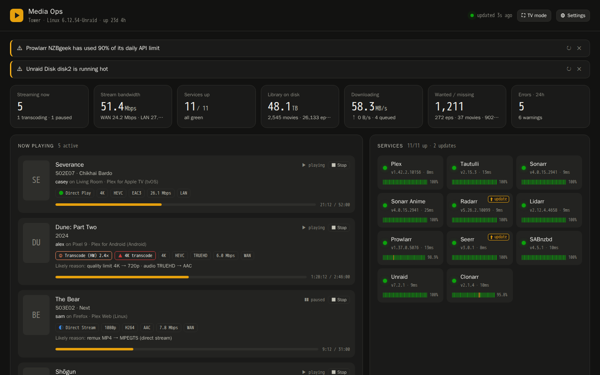
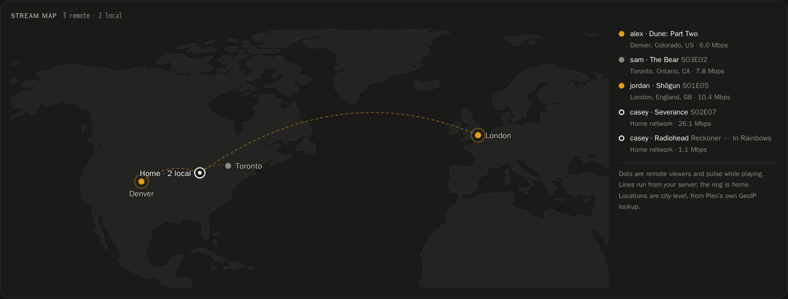
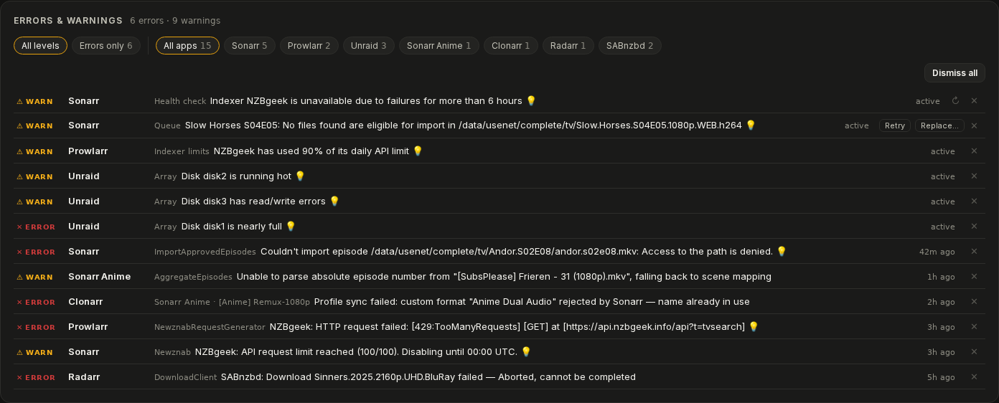
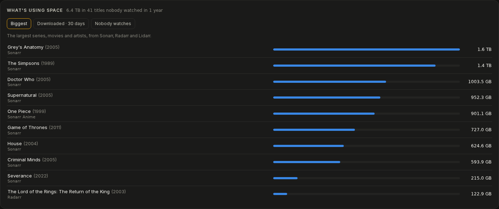
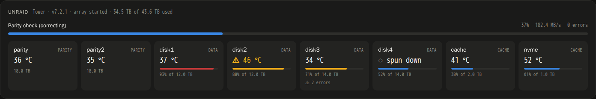
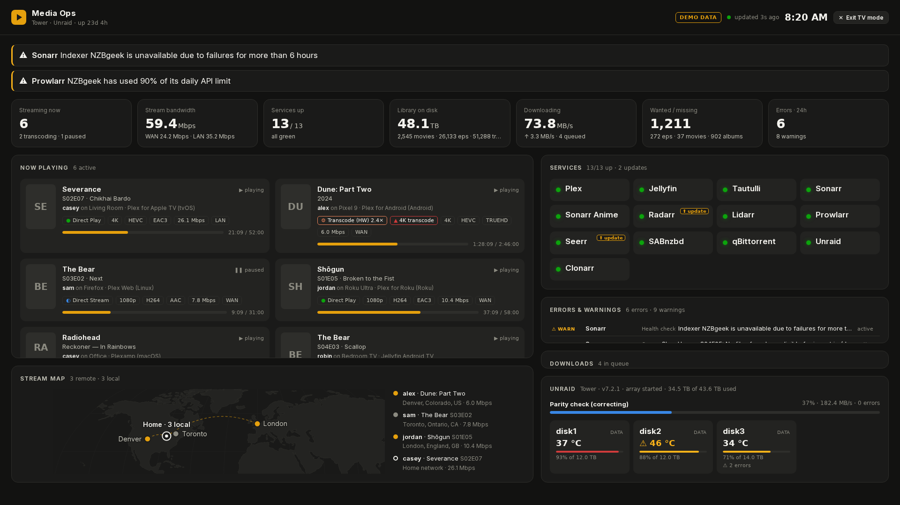
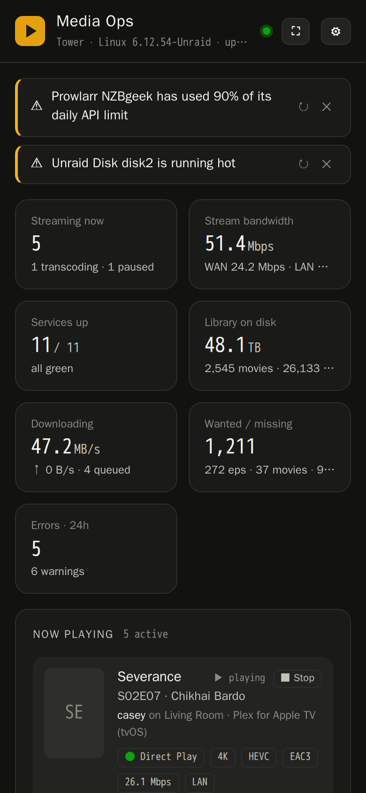
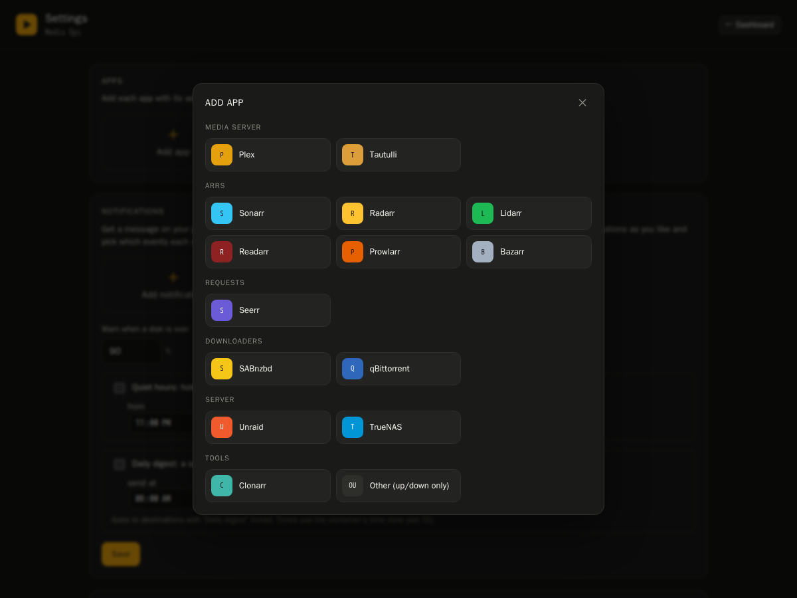

# Media Ops

**One page that tells you how your Plex server is doing.**

Media Ops is a dashboard for a home media server running Plex and the *arr apps (Sonarr,
Radarr, Prowlarr and friends). It shows you who's watching, what's downloading, what's
broken, and how full your disks are, all in one place, without opening ten browser tabs.

It runs as a single Docker container on Unraid, TrueNAS, Synology, Linux, Windows or a Mac.
You set it up from a settings page in your browser; there are no files to edit.



<sub>Screenshots use the built-in demo data.</sub>

## What it shows you

**Who's watching.** Every Plex stream with the viewer, device, quality and progress. When
something is transcoding, it tells you why ("the TV can't play HEVC", "subtitles are being
burned in"), and it flags 4K transcodes because those are the ones that slow your server down.

**Where they're watching from.** A world map with a dot for each viewer and a line back to
your server. It folds away when nobody's watching.



**What's broken, and how to fix it.** Errors and warnings from all your apps land in one list.
Common problems come with a 💡 and a one-line fix, like "database is locked" (move the app's
config folder to your cache drive) or an indexer hitting its daily limit. You can hide
anything you've dealt with, clear an app's log, or re-run its health checks.



**What's eating your disk space.** Your biggest shows and movies, what came in over the last
month, and (with Tautulli) the shows and movies nobody has watched in a year. It only lists
them; nothing is ever deleted.



**Your server's health.** For Unraid: the array, parity checks, and every disk's temperature
and fill level. For TrueNAS: pools, scrubs, disk temperatures, apps and alerts. Plus CPU,
memory, GPU load and your Docker containers.



**And a lot more:**

- Which apps are up, with a 24-hour uptime bar for each, and a badge when an update is out
- Downloads in progress (SABnzbd, NZBGet, qBittorrent, Transmission or Deluge), what's coming
  up this week, and what was just added to Plex
- Seerr requests you can approve or decline right from the dashboard
- How close each indexer is to its daily API limit
- Watch stats from Tautulli, and 24-hour charts of streams, bandwidth and download speed
- A forecast of when each disk will be full
- Buttons to stop a stream, retry a stuck download, or swap it for another release

## Make it yours

**Settings → Dashboard** lets you turn off the cards you never look at and change the order of
the rest. Every screen, TV mode included, uses the same layout.

## TV mode

A full-screen view for a spare tablet or TV. It sticks to what's worth seeing at a glance and
always fits on one screen. Open `http://<your-server>:8484/?tv=1` to go straight to it.



## A status page for the people you share with

Turn on **Settings → Status page** and share `http://<your-server>:8484/status` with the people
who use your Plex. They can check whether it's up, and see its uptime for the last day, without
asking you. You pick which apps it lists and can add a notice like "down for maintenance
tonight". It shows nothing else: no addresses, versions or errors.

## On your phone

The dashboard works on a phone too, and you can add it to your home screen like an app.



## Notifications

Get a message on Discord, Telegram, ntfy, Pushover, Gotify, email, or any webhook when
something happens.
For each destination you choose which events it gets:

- an app goes down or comes back
- a new error or warning
- a download fails or gets stuck
- a disk is filling up or running hot
- someone starts watching

You can also hold messages overnight (quiet hours) and get one daily summary each morning.
Media Ops waits for two failed checks in a row before saying an app is down, so a blip
won't wake you up.

## Install

Media Ops runs in Docker on almost anything: a NAS, a Linux box, a Raspberry Pi, or your Windows
PC or Mac. **[The install guide](docs/install.md) has step-by-step instructions for each one**,
including Synology, QNAP, Portainer and Proxmox. The short versions:

**Unraid.** Save [`unraid-template.xml`](unraid-template.xml) to your flash drive as
`/boot/config/plugins/dockerMan/templates-user/my-media-ops.xml`, then go to **Docker → Add
Container**, pick **media-ops** and click **Apply**.

**TrueNAS (24.10 or newer).** Go to **Apps → Discover Apps → ⋮ → Install via YAML** and paste in
[`truenas-compose.yml`](docs/truenas-compose.yml), with `tank` changed to your pool's name.
[More detail](docs/install.md#truenas).

**Linux.**

```bash
docker run -d --name media-ops --restart unless-stopped -p 8484:8484 \
  -e PUID=$(id -u) -e PGID=$(id -g) -e TZ=America/Chicago -e HOST_NAME=$(hostname) \
  -v ~/media-ops:/config \
  -v /var/run/docker.sock:/var/run/docker.sock:ro \
  ghcr.io/kaiserhomelab/media-ops:latest
```

**Windows** (with [Docker Desktop](https://www.docker.com/products/docker-desktop/)), in PowerShell:

```powershell
docker run -d --name media-ops --restart unless-stopped -p 8484:8484 `
  -e TZ=America/Chicago -e HOST_NAME=$env:COMPUTERNAME `
  -v C:\media-ops:/config `
  -v /var/run/docker.sock:/var/run/docker.sock:ro `
  ghcr.io/kaiserhomelab/media-ops:latest
```

**macOS** works like Linux, with Docker Desktop or OrbStack. **Docker Compose** fans can use
[`docker-compose.yml`](docker-compose.yml), which works on every system.

Then open `http://<that-computer's-ip>:8484`. To show free space for your media drives, map
them into the container too; the [install guide](docs/install.md) shows how for each system.

**Want to control when it updates?** `latest` always has the newest version. Use `:1.15` instead
to get fixes but not new features, or `:1.15.0` to stay on exactly that version. What changed in
each version is in the [changelog](CHANGELOG.md) and on the
[releases page](https://github.com/KaiserHomeLab/media-ops/releases).

## First steps

1. **Set a password.** Go to **Settings → Security**. Until you do, anyone on your network can
   change your apps, stop streams or clear logs. The dashboard reminds you until it's done.
2. **Add your apps.** Go to **Settings → Add app**, pick an app, and enter its address and API
   key. Each form tells you where that app keeps its key. Click **Test**, then **Save**.
   If Media Ops can see Docker (the Docker socket, or a socket proxy, under Settings →
   General), it lists the apps it **found in Docker** at the top: click one and the address
   is filled in for you, so you only paste its API key.



A few tips:

- Use your server's IP address, like `http://192.168.1.10:8989`, not `localhost`. (Inside a
  container, `localhost` means the container itself.) For apps installed directly on a
  Windows PC or Mac, use `host.docker.internal`. [More on addresses](docs/install.md#reaching-your-apps).
- Running two of the same app, like Sonarr and Sonarr Anime? Add it twice with different names.
- Drag the app cards to change the order on the dashboard.
- On Unraid or TrueNAS, Settings notices which one you're running and offers to add it.

### Setting up Unraid or TrueNAS

**Unraid (7.2 or newer):** In Unraid, go to **Settings → Management Access → API Keys** and
create a key. A read-only "viewer" key is all Media Ops needs. Then add **Unraid** in Media Ops
with your server's address and that key.

**TrueNAS (25.04 or newer):** In TrueNAS, add a user (for example `mediaops`) with the
**Read-Only Administrator** role. Then open your user menu (top right) → **API Keys** → **Add**,
and create a key for that user. In Media Ops, add **TrueNAS** with the address, the username
and the key.

## If something isn't working

Go to **Settings → Diagnostics → Run diagnostics**. It checks every app and shows exactly what
each one answered. **Copy short report** gives you something you can paste into a GitHub issue.
Passwords, API keys, IP addresses and usernames are removed from it first.

### Forgot your password?

You'll need access to the server itself. Any of these works:

- On the login screen, click **Forgot password?** → **Get a reset code**. The code shows up in
  the container's log (Unraid: Docker tab → media-ops icon → **Logs**; Docker Desktop: click the
  container; anywhere else: `docker logs media-ops`) and in a file called `password-reset.txt`
  in the settings folder. Codes expire after 15 minutes.
- Open the container's console (Unraid: Docker tab → media-ops icon → **Console**) and run
  `reset-password`, or run `docker exec media-ops reset-password` from a terminal. This removes
  the password.
- Edit `config.json` in the settings folder and set `"auth": null`.

## Good to know

- **Your settings** live in `config.json` in the folder you mapped to `/config`. Back up that
  folder and you've backed up everything. You can also download a backup from Settings.
- **Your API keys stay on the server.** They're never sent to your browser, and a saved key is
  only ever sent to the address it was saved for.
- **The dashboard is visible to anyone on your network** unless you turn on **Also require the
  password to view the dashboard** under Settings → Security. Turn that on before you make it
  reachable from outside your home, and put it behind a reverse proxy with https.
- **The Docker container list** needs access to Docker. Mounting the Docker socket gives the
  container full control of your server, so a safer way is to run a read-only
  [socket proxy](https://github.com/Tecnativa/docker-socket-proxy) (with `CONTAINERS=1`) and
  enter its address under Settings → General.
- **Media Ops checks GitHub every 6 hours** to see if there's a newer version. Nothing about
  your server is sent. You can turn this off under Settings → General.

More details are in [SECURITY.md](.github/SECURITY.md).

### Container options

Media Ops is built like a [linuxserver.io](https://www.linuxserver.io/) image, so the usual
options work:

| Variable | Default | What it does |
|---|---|---|
| `PUID` / `PGID` | `911` | The user the app runs as. Unraid: `99` / `100`. TrueNAS: `568` / `568`. Linux and Synology: run `id`. Windows and Mac: not needed. |
| `TZ` | `Etc/UTC` | Your time zone, like `America/Chicago`. Used for quiet hours and the daily summary. |
| `UMASK` | `022` | File permissions for new files. |
| `HOST_NAME` | container ID | The server name shown at the top of the dashboard. |
| `HOST_OS` | detected | The system it runs on (`Unraid`, `TrueNAS`, `Synology`, `Windows`...), if the guess is wrong. |
| `PORT` | `8484` | The port inside the container. |
| `DEMO` | | Set to `1` to see the dashboard with made-up data. |

## What's in this repo

| | |
|---|---|
| [`docs/install.md`](docs/install.md) | Step-by-step install for every system |
| [`docker-compose.yml`](docker-compose.yml) | Compose file that works anywhere |
| [`unraid-template.xml`](unraid-template.xml) | Unraid template |
| [`CHANGELOG.md`](CHANGELOG.md) | What changed in each version |
| [`src/`](src/) | The source code and the Dockerfile (see [CONTRIBUTING](.github/CONTRIBUTING.md) to work on it) |

## License and thanks

Media Ops is free and open source under the [MIT License](LICENSE).

It's only possible because of the apps it talks to: Plex, Sonarr, Radarr, Lidarr, Readarr,
Prowlarr, Bazarr, Tautulli, Seerr, SABnzbd, NZBGet, qBittorrent, Transmission, Deluge, Clonarr,
TRaSH Guides, Unraid and TrueNAS. Thanks also to linuxserver.io for the base image. Media Ops only uses their public
APIs and doesn't include any of their code. Licenses and links are in
[THIRD-PARTY-NOTICES.md](src/THIRD-PARTY-NOTICES.md).

Plex and the other app names are trademarks of their owners. Media Ops is an independent
project and isn't affiliated with or endorsed by any of them.
